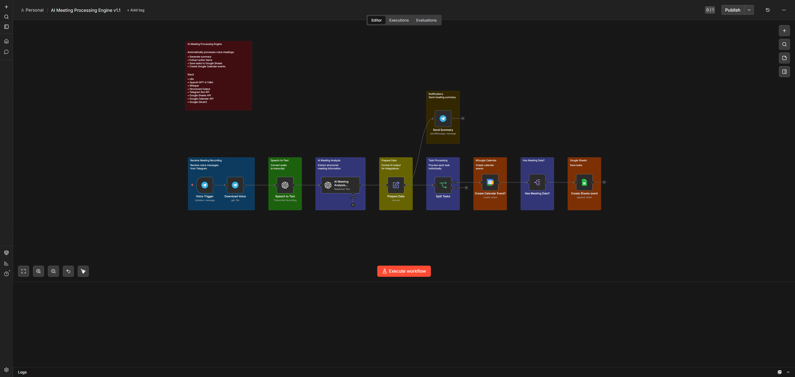

# AI Meeting Processing Engine

> Automatically processes voice meeting recordings using AI:
> transcribes audio, extracts action items, generates summaries, stores tasks, and creates Google Calendar events.


## Business Problem

After meetings, teams often spend time manually writing summaries, extracting action items, and updating task trackers and calendars. This process is repetitive, time-consuming, and prone to human error.


## Solution Overview

The workflow receives a voice message from Telegram, transcribes it into text using Whisper, analyzes the transcript with OpenAI, extracts structured meeting data, stores tasks in Google Sheets, creates Google Calendar events when meeting dates are detected, and sends a concise meeting summary back to Telegram.


## Workflow Architecture




## Workflow

```text
Telegram Voice Message
        │
        ▼
Speech-to-Text
        │
        ▼
AI Meeting Analysis
        │
        ▼
Prepare Data
        │
        ▼
Split Tasks
        ├── Google Calendar
        └── Google Sheets
        │
        ▼
Telegram Summary
```


## Architecture Decisions

- Whisper is used for speech-to-text transcription.
- Structured Output guarantees predictable JSON responses.
- Each extracted task is processed independently.
- Google Calendar events are created only when meeting dates are detected.
- Google Sheets is used as persistent task storage.
- Telegram is used as the primary interaction channel.

## Features

• AI-powered meeting analysis
• Automatic task extraction
• Google Calendar integration
• Google Sheets synchronization
• Telegram notifications
• Structured JSON output
• Independent task processing

## Tech Stack

n8n

OpenAI GPT-4o
Whisper

Telegram Bot API

Google Sheets API
Google Calendar API

## Repository Structure

README.md
LICENSE
workflow.png
workflow/
    ai-meeting-processing-engine.json

## Key Skills Demonstrated

- AI Workflow Design
- LLM Integration
- Structured Output
- Workflow Orchestration
- Google Workspace Integration
- Data Transformation
- Conditional Logic
- Speech-to-Text Processing
- Task Automation
- Business Process Automation

## Future Improvements

- Support multiple meeting languages.
- Store meeting summaries in a database.
- Add automatic email summaries.
- Integrate with project management tools (Jira, Trello, Asana).
- Generate meeting analytics and reports.

## Author

**Alexander Zaytsev**

AI Automation Engineer

- GitHub: https://github.com/AlexZaytsev-ai
- Email: polonix315@gmail.com
