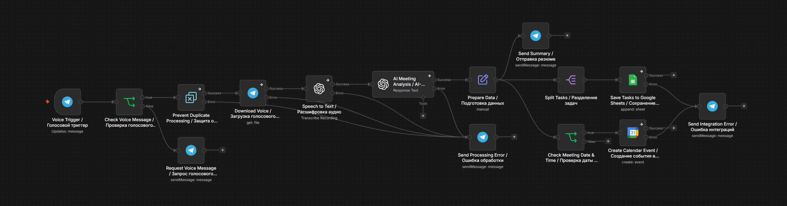

# AI Meeting Processing Engine

[English version](README.md)

Workflow на n8n, который преобразует голосовые записи встреч из Telegram в структурированные резюме, задачи и события Google Calendar.



## Бизнес-проблема

Результаты встреч часто обрабатываются вручную: необходимо расшифровать запись, подготовить резюме, выделить задачи и запланировать следующую встречу. Это занимает время и увеличивает риск потери важной информации.

## Решение

Workflow:

* получает голосовое сообщение из Telegram;
* отклоняет неподдерживаемые типы сообщений;
* защищает систему от повторной обработки;
* расшифровывает аудио;
* анализирует расшифровку с помощью GPT-5.1;
* возвращает структурированные данные встречи;
* отправляет резюме в Telegram;
* сохраняет каждую задачу отдельной строкой в Google Sheets;
* создаёт событие в Google Calendar только при наличии даты и времени.

## Архитектура workflow

```text
Voice Trigger / Голосовой триггер
    ↓
Check Voice Message / Проверка голосового сообщения
    ↓
Prevent Duplicate Processing / Защита от повторной обработки
    ↓
Download Voice / Загрузка голосового сообщения
    ↓
Speech to Text / Расшифровка аудио
    ↓
AI Meeting Analysis / AI-анализ встречи
    ↓
Prepare Data / Подготовка данных
    ├── Send Summary / Отправка резюме → Telegram
    ├── Split Tasks / Разделение задач → Google Sheets
    └── Check Meeting Date & Time / Проверка даты и времени → Google Calendar
```

После подготовки данных ветки Telegram, задач и календаря работают независимо друг от друга.

## Ключевые архитектурные решения

* Используется обычная OpenAI-нода, а не AI Agent: модель анализирует данные, но не выбирает инструменты.
* Строгая JSON Schema обеспечивает предсказуемый структурированный результат.
* Сохранение задач не зависит от создания события в календаре.
* Для события Google Calendar одновременно требуются дата и время.
* Повторные голосовые сообщения отсекаются по `chat.id` и `file_unique_id`.
* Ошибки основной обработки и ошибки интеграций используют отдельные ветки уведомлений.
* Credentials, ID документов, Calendar ID и webhook ID удалены из публичного JSON.

## Протестированные сценарии

* Обычный текст отклоняется с просьбой отправить голосовое сообщение.
* Встреча с задачами и следующей встречей создаёт результаты в Telegram, Google Sheets и Google Calendar.
* Повторная обработка одного голосового сообщения блокируется.
* Задачи сохраняются, даже если следующая встреча не назначена.
* Дата без времени не создаёт некорректное событие календаря.

## Технологии

* n8n
* Telegram Bot API
* OpenAI Speech-to-Text
* OpenAI GPT-5.1
* JSON Schema / Structured Outputs
* Google Sheets API
* Google Calendar API

## Запуск

1. Импортируйте `AI-Meeting-Processing-Engine.public.json` в n8n.
2. Подключите credentials Telegram, OpenAI, Google Sheets и Google Calendar.
3. Замените заглушки Google Sheet и Calendar своими ресурсами.
4. Активируйте workflow и отправьте голосовое сообщение в Telegram.

## Структура репозитория

```text
.
├── AI-Meeting-Processing-Engine.public.json
├── workflow-overview.png
├── README.md
├── README_RU.md
└── LICENSE
```

## Автор

**Alexander Zaytsev**
Junior AI Automation Engineer
[Профиль GitHub](https://github.com/AlexZaytsev-ai)

